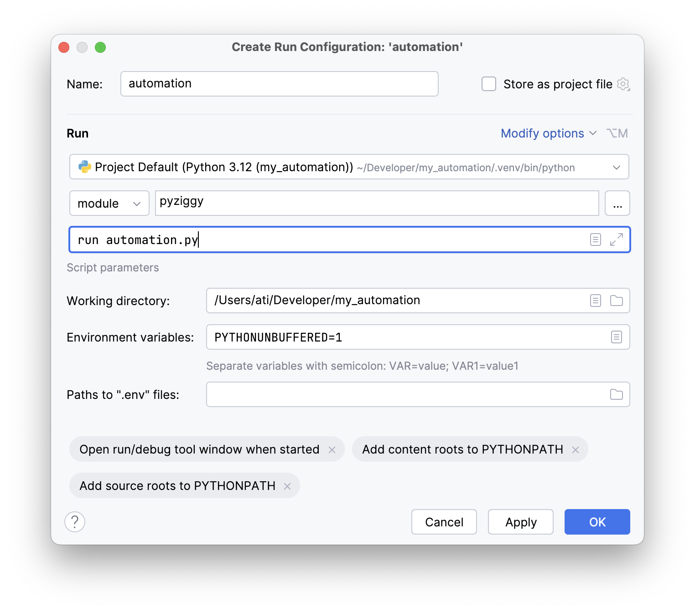

# Cookbook

## Recipes for building automations

The following are simple examples for typical use-cases. They assume an automation project set up in the way laid out in the <a href="index.html#a-minimal-automation-project">minimal automation project</a> section.

### Debugging your automation

This recipe also assumes, that pyziggy has been installed in the virtual environment under `my_automation/.venv`.

Open `my_automation` in PyCharm. It should detect the `.venv` subdirectory and automatically configure your environment.

Open the `my_automation.py` file from the project pane, right click in its editor window, and select *"Modify Run Configuration..."*. Provide the following details



Now you can press the debug button in PyCharm, and it should stop at breakpoints.

### Bind a light to a switch and run indefinitely

The full contents of `automation.py` for such a task would be as follows.

```
from pyziggy_autogenerate.available_devices import AvailableDevices

devices = AvailableDevices()

def switch_handler():
    action_type = devices.ikea_remote.action.enum_type
    action = devices.ikea_remote.action.get_enum_value()

    if action == action_type.on:
        devices.kitchen_light.state.set(1)
    elif action == action_type.off:
        devices.kitchen_light.state.set(0)
        
devices.ikea_remote.action.add_listener(switch_handler)
```

The `pyziggy run automation.py` command runs indefinitely by default. You can terminate it with the SIGINT signal, i.e. by pressing CTLR+C when running in a terminal.

***Side note:*** This example demonstrates how to use an enum parameter in a type safe way. For more on this, see
* {class}`pyziggy.parameters.EnumParameter`.

***Side note:*** pyziggy treats enum parameters with the name *action* a little differently, but you don't have to do anything about this. For more on this topic, see
* {func}`pyziggy.parameters.NumericParameter.set_always_call_listeners_on_report` 
* {data}`pyziggy.workarounds.Workarounds.make_action_enum_parameters_always_call_listeners`.

### Turn on a light and exit immediately

The full contents of `automation.py` for such a task would be as follows.

```
from pyziggy.message_loop import message_loop

from pyziggy_autogenerate.available_devices import AvailableDevices

devices = AvailableDevices()


def turn_on_and_exit():
    devices.kitchen_light.state.set(1)
    message_loop.stop_after_a_second()


devices.on_connect.add_listener(turn_on_and_exit)    
```

Since this script unconditionally changes parameters, and doesn't care about any state in the system, it is a perfect candidate for using the `--no_startup_query` argument. For more about this, see the <a href="cli.html#named-arguments">Command-line-reference</a>. 

Note the call to {func}`pyziggy.message_loop.MessageLoop.stop_after_a_second` as opposed to calling {func}`pyziggy.message_loop.MessageLoop.stop`. This is necessary, because `stop()` would immediately exit the message loop, and the pyziggy wouldn't have a chance to send the MQTT messages for the light.

***Side note:*** For more on this behaviour, see 
* {func}`pyziggy.parameters.SettableNumericParameter.set`.

### Execute a series of operations at timed intervals, then exit

The full contents of `automation.py` for such a task would be as follows.

```
from typing import override

from pyziggy.message_loop import message_loop
from pyziggy.util import TimedRunner

from pyziggy_autogenerate.available_devices import AvailableDevices

devices = AvailableDevices()


class MyTasks(TimedRunner):
    @override
    def run(self):
        if self.wait(1):
            devices.kitchen_light.brightness.set_normalized(1)
            devices.kitchen_light.color_temp.set(454)

        if self.wait(1):
            devices.kitchen_light.state.set(1)

        if self.wait(1):
            devices.kitchen_light.state.set(0)

        if self.wait(1):
            devices.kitchen_light.color_temp.set(179)

        if self.wait(1):
            devices.kitchen_light.state.set(1)

        if self.wait(1):
            devices.kitchen_light.color_temp.set(255)
            message_loop.stop_after_a_second()


_ = MyTasks(devices)
```

Since this script unconditionally changes parameters, and doesn't care about any state in the system, it is a perfect candidate for using the `--no_startup_query` argument. For more about this, see the <a href="cli.html#named-arguments">Command-line-reference</a>.

For more on the utility class, see
* {class}`pyziggy.util.TimedRunner`

### Launch a webserver that exposes automation functions

Pyziggy has a Flask integration and the `pyziggy run automation.py` command will automatically pick up a Flask object, and start listening on the port defined in `config.toml`.

It's all straightforward by-the-book Flask, you only need to take care of the synchronization with the {mod}`message_loop`. This is demonstrated in the recipe below.

The full contents of `automation.py` for such a task would be as follows.

```
from flask import Flask, request

from pyziggy_autogenerate.available_devices import AvailableDevices

devices = AvailableDevices()


def turn_off_all_lights():
    for device in devices.get_devices():
        if isinstance(device, LightWithDimming):
            device.state.set(0)


app = Flask(__name__)


def http_message_handler(payload):
    if "action" in payload:
        action = payload["action"]

        if action == "turn_off_all_lights":
            turn_off_all_lights()


@app.route("/pyziggy")
def http_pyziggy_help():
    commands = [
        {"action": "turn_off_all_lights"},
    ]

    html = make_html("Send commands to <code>/pyziggy/post</code>.", commands)
    return html, 200


@app.route("/pyziggy/post", methods=["POST"])
def http_pyziggy_post():
    payload = request.get_json()

    def message_callback():
        http_message_handler(payload)

    message_loop.post_message(message_callback)

    return "", 200
```

I omitted the `make_html` function, but you can see it in the complete automation project example at <https://github.com/bebump/pyziggy-example>.

With a POST endpoint exposed, like above, it's very easy to trigger pyziggy automation functions with tools such as iOS Shortcuts, which also makes them easy to trigger using Siri voice commands.

### Create a self-contained, executable script

Until now, all examples used the `pyziggy run automation.py` command. This recipe shows how to create a single `.py` script that you can execute directly.

The downside of this approach is, that it doesn't connect to MQTT prior to launching your automation and doesn't regenerate the `AvailableDevices` type, so it can contain out-of-date information. Because of this, I don't recommend this, but it can be done.

The full contents of `automation.py` for such a task would be as follows.

```
from pyziggy import PyziggyConfig
from pyziggy.run import run_command

from pyziggy_autogenerate.available_devices import AvailableDevices

devices = AvailableDevices()

config = PyziggyConfig.load("config.toml")
assert config is not None

run_command(devices, config)
```

You can now execute this script directly with `python automation.py`.

## Working with the `pyziggy-setup` script

```{warning}
**The script makes changes to the directory it's in. Not the current working directory.** And I might change this behavior in future versions, so use this script at your own peril.
```

### Set up a project directory with a `.venv` directory and pyziggy installed

We'll create a new project in the `my_automation` directory. This requires that `pyenv` is installed on your system.

```
mkdir my_automation
cd my_automation
```

The next block downloads the `pyziggy-setup` script into `my_automation`, downloads an appropriate version using `pyenv`, creates a `.venv` subdirectory, and installs `pyziggy` in it.

```
curl -fsSL https://raw.githubusercontent.com/bebump/pyziggy/refs/heads/main/util/pyziggy-setup -o pyziggy-setup
chmod u+x pyziggy-setup
./pyziggy-setup setup
```

You can now activate the virtual environment, and create your pyziggy project

```
source .venv/bin/activate
pyziggy run automation.py
```

### Automatically deploy a project to a remote machine and run it as a service

```{warning}
This feature is currently supported on MacOS only.
```

This recipe assumes 
* the <a href="index.html#a-minimal-automation-project">minimal automation project</a>, 
* with the addition, that the `pyziggy-setup` script has also been placed in the project directory,
* and a `requirements.txt` also added to your project directory, containing all required dependencies, including `pyziggy`,
* a remote machine with the project machine's SSH key added to its `authorized_keys`,
* rsync 3.2.0 or greater installed on the project machine, and
* pyenv installed on the remote machine.

So this is what your project directory should look like

```
my_automation/
├─ pyziggy_autogenerate/
│  └─ available_devices.py
├─ automation.py
├─ config.toml
├─ pyziggy-setup
└─ requirements.txt

```

Run

```
./pyziggy-setup sync-remote start automation.py
```

The command will create a default `remote.json` file in the project directory, instruct you to edit it, and exit. Here's the full contents of `remote.json`.

```
{
    "ssh_host": "192.168.1.56",
    "ssh_user": "home_automation",
    "ssh_remote_dir": "~/pyziggy_automation"
}
```

The `ssh_remote_dir` is the directory where the project will be uploaded. The `pyziggy-setup` script will automatically create this directory if it doesn't exist.

After editing `remote.json`, issue again

```
./pyziggy-setup sync-remote start automation.py
```

This command will

1. Create the `pyziggy_automation` directory under the `home_automation` user, if it doesn't exist.
2. Use rsync to upload the contents of your project directory to `pyziggy_automation`.
3. Create a virtual environment under `~/pyziggy_automation/.venv` and install `~/pyziggy_automation/requirements.txt` into it.
4. Stops and uninstalls any currently running `net.bebump.pyziggy` services.
5. Verifies that your new project installation can be launched.
6. Installs a new `net.bebump.pyziggy` service, and launches it.

If at any point the script encounters an error condition, it exits with 1. The logs written by the service are redirected to `/tmp/net.bebump.pyziggy/stdout.log` and `/tmp/net.bebump.pyziggy/stderr.log`.

### Stop the service running on the remote

```{warning}
This command will overwrite the contents in your local project directory, with contents in the remote service directory. If you don't trust the state of the remote service directory, use something like `git` to avoid data loss. `.gitignore` files are respected and contents of the `.git` directory aren't overwritten.
```

```{warning}
This feature is currently supported on MacOS only.
```

See the previous section. Assuming a `remote.json` file with the correct values, run 

```
./pyziggy-setup sync-remote stop
```

This command will 

1. Use rsync to download the contents from the remote directory into your local your project directory, overwriting anything.
2. Stops and uninstalls any currently running `net.bebump.pyziggy` services on the remote.

### Running `pyziggy-setup` from PyCharm

Pretty obvious, but all of these commands can be added as run configrations to PyCharm.

This is what my PyCharm project configuration looks like. I'm only showing the `sync-remote start` pane, the rest should be obvious based on the earlier sections.


